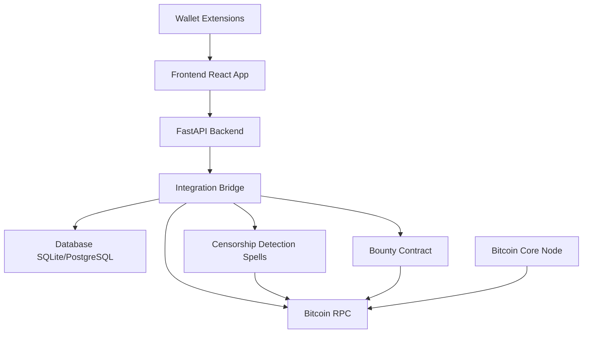

# 🛡️ MineSentry

> **Decentralized Bitcoin Mining Pool Monitoring & Censorship Detection System**

[](https://opensource.org/licenses/MIT)
[](https://www.python.org/downloads/)
[](https://reactjs.org/)
[](https://bitcoin.org/)

MineSentry is a decentralized application that monitors Bitcoin mining pools for censorship and manipulation in the UTXO space. It rewards users for reporting and validating suspicious activities through a multi-signature bounty contract system.

## 🎯 Overview

MineSentry uses advanced detection algorithms (Charms-based spells) to identify various forms of mining pool manipulation, including transaction censorship, selfish mining, block reordering, and more. The system operates on a decentralized reward model where verified reports earn Bitcoin bounties.

## ✨ Features

- **🔍 10 Detection Methods**: Comprehensive censorship detection using multiple analysis techniques
- **💰 Bounty System**: Decentralized multi-signature contract for reward distribution with public transparency dashboard
- **📊 Real-time Monitoring**: Live dashboard showing pool behavior and system statistics
- **🔐 Multi-Wallet Support**: Connect with Hiro, Xverse, Leather, UniSat, or Nostr wallets
- **📝 Report Management**: Submit, validate, and track censorship reports with detailed evidence review
- **🎯 Evidence-Based Validation**: Validator voting system with Bitcoin staking for confirm/reject decisions
- **📈 Leaderboards**: Track top reporters and top bounty hunters with earnings statistics
- **🌐 Network Detection**: Automatic mainnet/testnet detection
- **🔒 Signature Verification**: Wallet-based authentication
- **🎮 Demo Mode**: Isolated testing environment with mock data for exploring the system
- **🔍 Transparency Dashboard**: Public read-only view of bounty contract treasury, governance, and payout history
- **✅ Interactive Validation**: Modal-based report validation with collapsible evidence review sections

## 🏗️ Architecture



## 🚀 Quick Start

### Prerequisites

- **Python 3.8+**
- **Node.js 18+** and npm
- **Bitcoin Core** (for RPC access)
- **Git**

### Installation

1. **Clone the repository**
   ```bash
   git clone https://github.com/RanneG/MineSentry.git
   cd MineSentry
   ```

2. **Set up Python backend**
   ```bash
   python3 -m venv venv
   source venv/bin/activate  # On Windows: venv\Scripts\activate
   pip install -r requirements.txt
   ```

3. **Configure Bitcoin RPC**
   ```bash
   cp .env.example .env
   # Edit .env with your Bitcoin RPC credentials
   ```

4. **Initialize database**
   ```bash
   python init_db.py
   ```

5. **Set up frontend**
   ```bash
   cd frontend
   npm install
   ```

6. **Start the backend**
   ```bash
   python api.py
   ```

7. **Start the frontend** (in a new terminal)
   ```bash
   cd frontend
   npm run dev
   ```

8. **Access the application**
   - Frontend: http://localhost:3000
   - API: http://localhost:8000
   - API Docs: http://localhost:8000/docs

For detailed setup instructions, see [QUICKSTART.md](docs/setup/QUICKSTART.md).

## 🔬 Detection Methods

MineSentry uses **10 detection methods** to identify censorship and manipulation:

| Method | Weight | Type | Description |
|--------|--------|------|-------------|
| **Missing Transactions** | Critical | Core | Verifies if suspected transactions are excluded from blocks |
| **Fee Rate Discrepancy** | Critical | Core | Compares fee rates of included vs excluded transactions |
| **Block Fullness Analysis** | Medium | Core | Detects blocks with space excluding high-fee transactions |
| **Transaction Ordering** | Medium | Core | Identifies suspicious transaction ordering patterns |
| **Transaction Age Analysis** | Medium | Advanced | Detects exclusion of older high-fee transactions |
| **Size Preference Analysis** | Medium | Advanced | Identifies bias toward smaller transactions |
| **Fee Density Analysis** | Medium | Advanced | Analyzes fee per byte efficiency patterns |
| **Historical Pattern Comparison** | Low | Advanced | Compares with recent block patterns |
| **Address Pattern Analysis** | Low | Advanced | Detects unusual address clustering patterns |
| **Confirmation Time Analysis** | Critical | Advanced | Analyzes excessive confirmation delays |

### Confidence Scoring

Reports receive a confidence score (0.0-1.0) based on:
- **Method Score**: 0.15 per method (max 0.6)
- **Evidence Score**: 0.05 per evidence point (max 0.4)
- **Critical Method Bonus**: 0.1 per critical method (max 0.3)

## 📁 Project Structure

```
MineSentry/
├── frontend/              # React + TypeScript frontend
│   ├── src/
│   │   ├── components/    # React components (DemoModeToggle, ValidateReportModal, etc.)
│   │   ├── pages/         # Page components (Dashboard, Reports, BountyContract, etc.)
│   │   ├── contexts/      # React contexts (DemoModeContext)
│   │   ├── hooks/         # Custom React hooks (useWallet)
│   │   ├── store/         # Zustand state management
│   │   ├── lib/           # Utility libraries (wallet providers)
│   │   ├── api/           # API client and mock data
│   │   └── types/         # TypeScript type definitions
│   └── package.json
├── spells/                # Charms-based detection spells
│   ├── censorship_detection.py  # Censorship detection logic
│   └── bounty_contract.py       # Bounty contract implementation
├── docs/                  # Documentation directory
│   ├── setup/             # Setup guides
│   └── guides/            # Developer guides
├── scripts/               # Utility scripts
│   └── setup.sh           # Setup automation
├── api.py                 # FastAPI REST API
├── integration_bridge.py  # System integration layer
├── bitcoin_rpc.py         # Bitcoin RPC client
├── database.py            # Database models and setup
├── models.py              # Data models
├── validation.py          # Report validation logic
├── reward_system.py       # Reward calculation
├── setup_bounty_contract.py  # Bounty contract setup script
├── init_db.py             # Database initialization
├── requirements.txt       # Python dependencies
├── README.md              # This file
├── CONTRIBUTING.md        # Contribution guidelines
└── SECURITY.md            # Security policy
```

## 🎮 Usage

### Submitting a Report

1. Connect your Bitcoin wallet
2. Navigate to "Submit Report"
3. Fill in:
   - Pool address
   - Block height
   - Evidence type
   - Transaction IDs
4. Submit and wait for validation

### Viewing Bounty Contract Transparency

1. Navigate to "Bounty Contract" page
2. View the public transparency dashboard showing:
   - Contract address and current balance
   - Governance rules (signers and signature threshold)
   - Complete payout history with block explorer links
3. Click any address or transaction ID to verify on the blockchain
4. Note: Contract setup is done via backend scripts for security (see `setup_bounty_contract.py`)

### Validating Reports

1. View reports in the "Reports" page
2. Click on a report to see details
3. Click "Validate Report" button (hidden for report submitter)
4. Review evidence and report details in the validation modal
5. Vote "Confirm" or "Reject" with a Bitcoin stake amount
6. Submit your vote to contribute to the validation decision
7. Once reports are validated, they enter the payment queue for authorized signers

## 🛠️ Development

### Running Tests

```bash
# Backend tests
pytest

# Frontend tests
cd frontend
npm test
```

### Code Style

- **Python**: Follow PEP 8, use Black for formatting
- **TypeScript**: Follow ESLint rules, use Prettier

### Contributing

See [CONTRIBUTING.md](CONTRIBUTING.md) for detailed contribution guidelines.

## 🔒 Security

**⚠️ IMPORTANT**: MineSentry deals with real Bitcoin. Always:

- Test on testnet first
- Never share your RPC credentials
- Use strong passwords
- Keep private keys secure
- Audit smart contracts before mainnet deployment

See [SECURITY.md](SECURITY.md) for detailed security guidelines.

## 📊 Roadmap

- [ ] Additional detection methods
- [ ] Machine learning-based pattern recognition
- [ ] Lightning Network integration for micro-payments
- [ ] Mobile app (React Native)
- [ ] Historical data analysis dashboard
- [ ] Pool reputation scoring system
- [ ] Decentralized governance
- [ ] Multi-chain support

## 📄 License

This project is licensed under the MIT License - see the [LICENSE](LICENSE) file for details.

## 🙏 Acknowledgements

- Bitcoin Core developers
- Charms framework community
- All contributors and testers

## 🔗 Links

- **Documentation**: See `/docs` folder
- **API Documentation**: http://localhost:8000/docs (when running)
- **Repository**: [GitHub](https://github.com/RanneG/MineSentry)
- **Issues**: [GitHub Issues](https://github.com/RanneG/MineSentry/issues)
- **Discussions**: [GitHub Discussions](https://github.com/RanneG/MineSentry/discussions)

## 📞 Support

For questions, issues, or contributions:
- Open an issue on GitHub
- Check [TROUBLESHOOTING.md](docs/guides/TROUBLESHOOTING.md)
- Review [QUICKSTART.md](docs/setup/QUICKSTART.md)

---

**Made with ❤️ for Bitcoin decentralization**

